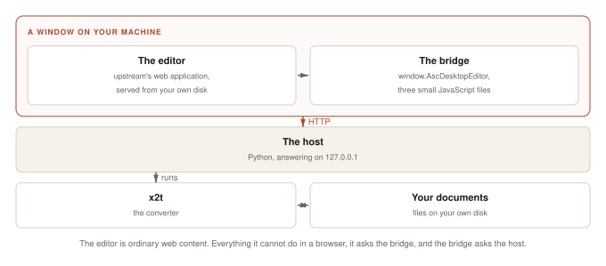
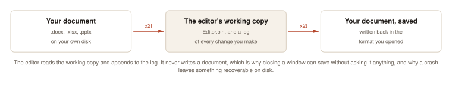

# Architecture

A document opens through three things: a window the operating system provides, an HTTP server the application runs on loopback, and a converter it shells out to.



## The pieces

```
libera FILE
      │
      │   host/, innermost first -- nothing imports anything above it
      │
      ├── session.py    who is editing what, bound per request
      ├── hooks.py      callbacks the window layer installs
      ├── desktop.py    reveal a file, open a URL, whose account this is
      ├── convert.py    x2t: documents in, documents out
      ├── recents.py    the Recent list
      ├── opening.py    opening a document into a session
      ├── server/       HTTP: routing, endpoints, the injected bridge
      ├── window/       windows, dialogs, the close prompt
      ├── menu/         the menu bar: AppKit's on macOS, GTK's on Linux
      │
      └── bridge-runtime.js  ┐ window.AscDesktopEditor and the shims around
          bridge-page.js     │ it, injected into every page before the
          bridge-desktop.js  ┘ editor's own scripts run
```

The editor is ordinary web content. It is served over loopback to a WebKit window on your own machine, with one script injected ahead of it.

## The contract

The editor talks to its host through a single JavaScript object, `window.AscDesktopEditor`. That object is the contract: everything the editor cannot do in a browser, it asks for there.

Libera Suite implements the object in JavaScript, backed by a Python server over HTTP, so the host is a few thousand lines.

The offline editor itself is already in upstream's source. We answer it unmodified: three files, about 1,200 lines, selected at build time by `SDK_PLATFORM=desktop`.

## How a document moves



`x2t` converts the document into `Editor.bin`. The editor opens that and streams its edits as a change log. Saving merges the two back through `x2t` into a real document, in the format you opened.

Two things follow. Closing a window can save without asking the editor anything, because the host already holds everything it needs. A crash leaves a working copy and a log on disk, which is what crash recovery offers you back.

## What the host does

| the editor asks | the host does |
| :--- | :--- |
| open this document | runs `x2t` to convert it into the editor's working format |
| here are my changes | appends them to a change log |
| save | runs `x2t` to merge the working format and the change log back into a document |
| print | the same, to PDF, then hands the file to the desktop |
| open / save-as dialog | puts a real native dialog on screen |
| new document | copies a blank from the payload |
| open an external link | hands the URL to your browser |

Every one of these is a small HTTP endpoint. The conversions run in upstream's `x2t` binary, the same one upstream uses.

## x2t and doctrenderer

`x2t` is the converter. For most formats it is C++ all the way down. For PDF it is not: `doctrenderer` embeds V8 and runs the editor's own JavaScript layout engine server-side, so the PDF you print is laid out by the same code that drew the screen.

The PDF path needs the *real* font files and a font index with absolute paths to them. The obfuscated copies the browser downloads will not do. Get that wrong and it fails inside V8 with a JavaScript type error; get it half-wrong and it segfaults.

## The payload

The application and the payload are separate artifacts on separate version numbers.

| | |
| :--- | :--- |
| the Python package | a few hundred KB, on PyPI |
| `core-<platform>.tar.gz` | 58 MB on macOS, 68-70 MB on Linux: `x2t` and the native libraries |
| `editors.tar.gz` | sdkjs and web-apps: all four editors, the blanks and the dictionaries |
| `fonts-core.tar.gz` | 4 MB: font *sources* (the browser's copies are generated from these) |

Two things force that split. Generated files hold absolute paths, so they must be produced on the target machine. `doctrenderer` reads real `.ttf` files, so we ship font sources and generate the browser's copies locally at install time.

## Design notes

**Branding is build-time configuration.** The product name, the logos and the application name written into saved documents are all upstream configuration points.

**Our changes to upstream are a patch queue.** See [The patch queue](patches.md).

**One observation is not a diagnosis.** The regression harness exists because of a string of confident wrong answers about why the editor would not load. Each was consistent with the evidence and each was wrong.
