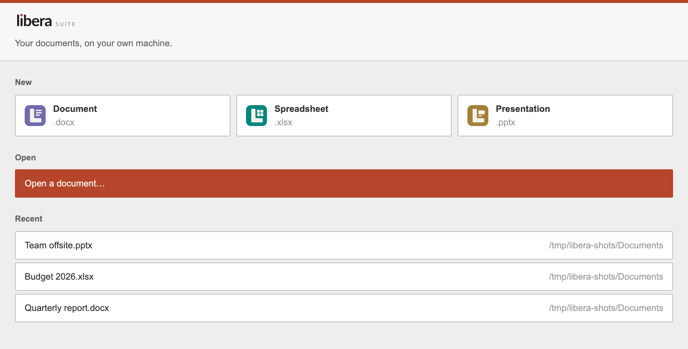

# Work with documents

## Open

```sh
libera                             # the start window
libera ~/Documents/note.docx
libera ~/Documents/budget.xlsx
libera ~/Documents/network.vsdx
```

**The document decides which editor you get.** There is no command to pick one, in the same way there is no command to pick a text editor for a `.txt`: you open the document and the right editor comes up. An `.xlsx` opens in Tables, a `.pptx` in Slides, a `.vsdx` in Diagrams.



`libera` on its own opens the **start window**: a new document of any kind, an open dialog, your recent documents, and where the payload came from. Pick something and the start window goes away, leaving you with the document.

Libera Suite opens **one document per window**, so a shell glob does what it looks like it does:

```sh
libera ~/Documents/*.docx     # one window each
```

You can also open a document from inside the editor, through **File ▸ Open** or **File ▸ Open Recent**. Either opens a new window; neither disturbs the document you already have open.

## Save

**File ▸ Save** writes back to the document you opened. **File ▸ Save As** asks where to put it. From then on that is the document you are editing.

Saving converts the editor's working format back into a real document, which takes about a second.

## Export

Save As is also how you export: its dialog carries a **File Format** popup.

| | |
| :--- | :--- |
| Word Document | `.docx` |
| Word Template | `.dotx` |
| OpenDocument Text | `.odt` |
| OpenDocument Template | `.ott` |
| PDF | `.pdf` |
| Rich Text Format | `.rtf` |
| HTML | `.html` |
| Markdown | `.md` |
| EPUB | `.epub` |
| FictionBook | `.fb2` |
| Plain Text | `.txt` |

Choosing a format renames the file in the dialog. The dialog will not let the two disagree: you cannot end up with an ODT called `.docx`.

Not every format the converter can read is one it can write. `.doc` in particular opens but does not save; use `.docx` or `.rtf` for something that has to go back to an old Word.

If you are looking for a **Download As** entry in the File menu, there isn't one. The editors hide it when they run as an offline desktop application and put Save As in its place: the same job, one menu entry earlier.

## The menu bar

On Linux the bar is GTK's and sits inside the window: **File**, **Edit**, **View** and **Help**. Three differences follow from what GTK offers. None of the items has a keyboard shortcut, so the keys below belong to the editor and work inside the page. **Open Recent** is built when the application starts, so a document you open today appears in it tomorrow. Nothing greys out, so Save with nothing to save does nothing.

On macOS it is a real Mac menu bar, carrying the same items plus **Window**. The usual shortcuts work there whether or not the editor has focus:

| | |
| :--- | :--- |
| `⌘N` `⌘O` | New, Open: each in its own window |
| `⌘S` `⇧⌘S` | Save, Save As |
| `⌘P` | Print |
| `⌘W` | Close, asking about unsaved changes first |
| `⌘Z` `⇧⌘Z` | Undo, Redo |
| `⌘F` | Find |
| `⌘?` | This documentation |
| `⌘+` `⌘-` `⌘0` | Zoom in, out, fit the page |
| `⌘8` | Formatting marks |

**File ▸ Open Recent** is rebuilt each time you open it. The **Window** menu lists every open document.

Save, Undo and Redo are greyed out when there is nothing to save or undo. The editor declines those silently: a menu item that stayed available would look broken.

## Closing

Closing a window with unsaved changes asks first: **Save**, **Don't Save** or **Cancel**.

Choosing Don't Save is not final. Libera Suite keeps what you wrote, and offers it back the next time you open that document.

## Print

**File ▸ Print**, or the printer button, renders the document to PDF and opens it in your system's PDF viewer, where the print dialog lives.

That is the choice for now: the viewer you already have gives you page ranges, paper size, scaling and a preview, none of which we would build better in the first version.

## Images

Images embedded in a document are preserved on open and save. **Insert ▸ Image** adds an image from disk.

## Where your working files go

While a document is open, Libera Suite keeps a session directory alongside its application data. It holds the editor's working copy and a running log of your changes, which makes saving fast and undo reliable. It is not a backup: the document is where you saved it.
