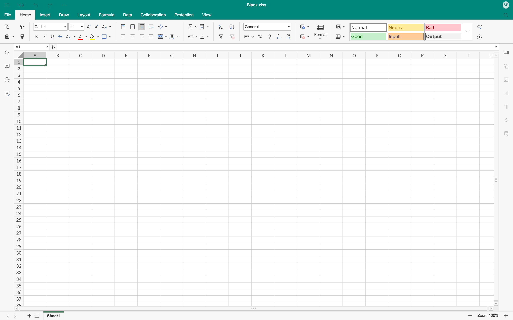
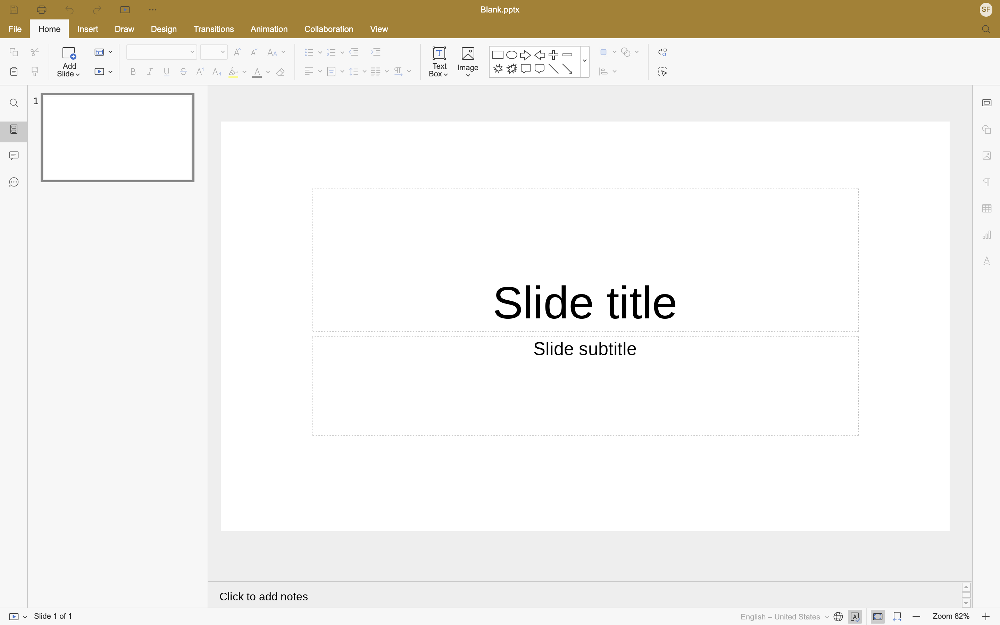

# Using Libera Suite

Libera Suite opens a document in a window and lets you edit and save it. Words, Tables and Slides all work that way; Diagrams opens Visio files to read. Check [What works today](status.md) before you install anything.

- [Install](install.md): getting it onto your machine, including the payload.
- [Work with documents](documents.md): opening, saving, printing.
- [What works today](status.md): what works and what does not.

Each editor carries its own colour. Everything else about the window is the same:

## The shape of it

Libera Suite is two pieces that arrive separately.

**The application** is a small Python package. It is a few hundred kilobytes: the window, the command line, and the host that the editor talks to.

**The payload** is everything else: the editors themselves, the document engine, the fonts. It is about 110 MB compressed on macOS and 120 MB on Linux. You fetch or install it once. The Python package does not carry it.

They are versioned separately and the application checks that the payload it finds is the one it expects. This is why installing Libera Suite takes two steps.

## What it is not

Libera Suite talks to no server, needs no account and never uploads your documents. The editor runs as local web content served over `127.0.0.1` to a window on your own machine. There is no collaboration, cloud storage or telemetry, because none of it is built.
