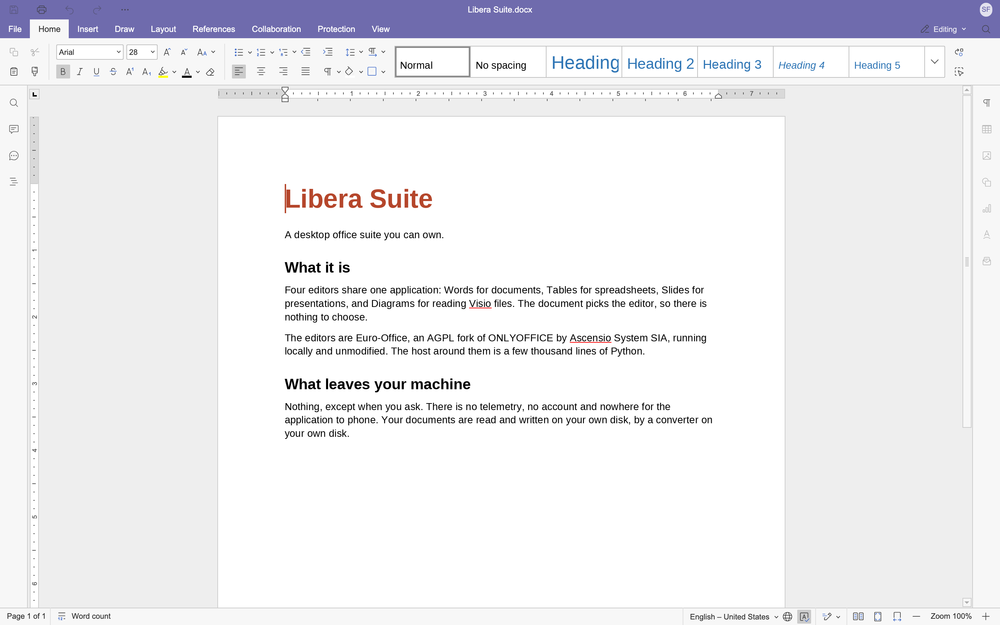

# Libera Suite

**Libera Suite** is Abilian's desktop office suite: a word processor, a presentation editor and a spreadsheet that run on your own machine, on your own files, with no account or server.

It is built from [Euro-Office](https://github.com/Euro-Office), an AGPL fork of ONLYOFFICE by Ascensio System SIA, wrapped in a small Python host. The editors are the real thing, running locally: the same document engine, the same format support.

- **Libera Words**: documents (`.docx`, `.odt`, `.rtf`, `.txt`, `.md` and more)
- **Libera Tables**: spreadsheets (`.xlsx`, `.ods`, `.csv`)
- **Libera Slides**: presentations (`.pptx`, `.odp`)
- **Libera Diagrams**: Visio drawings (`.vsdx`), read only

## Where the project is

All four run today, on **Linux** (x86_64 and arm64) and **macOS** (Apple Silicon). It is early. [What works today](guide/status.md) is a status list: it says what is built, what is half-built and what is not started.

If you want to try it, start with [Install](guide/install.md). If you want to build it, start with the [developer overview](develop/index.md).

## Why

Most of the work of an office suite is the document engine, the part that reads a `.docx` written by somebody else's software and lays it out the way they meant. That engine already exists as free software and already runs offline. A desktop host for it that is small enough for one team to own was missing.

Libera Suite is that host: a few thousand lines of Python and JavaScript. Everything else is upstream.

## What leaves your machine

Nothing leaves it, except when you ask.

Libera Suite has **no telemetry**, analytics, crash reporting or accounts. Nothing in it opens a connection to us. If anything of the kind is ever added, it will be off until you turn it on. This page will list it.

The table lists the whole of its network use, so you can check the claim:

| | |
| :--- | :--- |
| **The payload**, once | Downloaded from `cdn.abilian.com` the first time you install it, and verified against hashes shipped inside the application. After that, never again. |
| **The editor's own traffic** | A web server on `127.0.0.1` that is part of the application, serving the editor to a window on the same machine. It is not reachable from anywhere else. |
| **Links you click** | Help and similar open in *your* browser. Libera Suite does not fetch them. |

Your documents are read and written on your disk, by a converter on your disk. They are never uploaded, indexed or inspected.

## Licence and source

Libera Suite is free software: the host is [Apache-2.0](licence.md) and the editor payload it runs is AGPL v3, as is the Euro-Office code that payload is built from. Every release records the exact upstream revisions it was built from and the patches applied to them, so the corresponding source is always a commit plus a patch series that provably applies to it.
