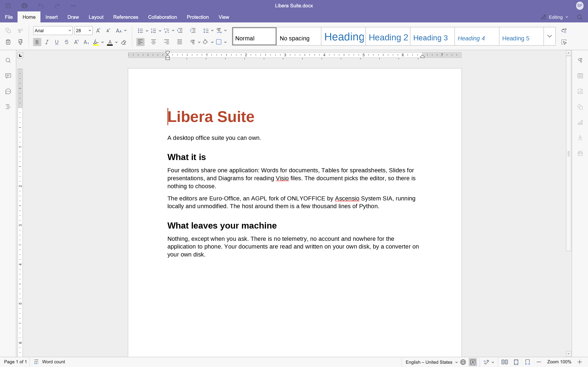

# Libera Suite

**Libera Suite** is a free and open-source office suite for Windows, macOS and Linux, made by Abilian. Write documents, work on spreadsheets and make presentations on your own computer, with your own files, and with no account or cloud service.

It opens and saves the file formats of Microsoft Office and LibreOffice, so you can exchange documents with anyone, whatever they use. It is an alternative to Microsoft Word, Excel and PowerPoint that costs nothing, and since it is free software, anyone may read its source code, change it and share it.

- **Libera Words**, for text: `.docx`, `.odt`, `.rtf`, `.txt`, `.md` and more
- **Libera Tables**, for spreadsheets: `.xlsx`, `.ods`, `.csv`
- **Libera Slides**, for presentations: `.pptx`, `.odp`
- **Libera Diagrams**, a viewer for Visio drawings (`.vsdx`)

[Install Libera Suite](main/install.md){ .md-button .md-button--primary }

## In six slides

<a href="pdf/Libera%20Suite.pdf">Libera Suite, in six slides (PDF)</a>

## Where the project is

All four run today, on **Windows** 10 and 11 (x64), **Linux** (x86_64 and arm64) and **macOS** (Apple Silicon). It is early. [What works today](main/status.md) is a status list: it says what is built, what is half-built and what is not started.

If you want to try it, start with [Install](main/install.md): one command covers Linux and macOS, while Windows has an installer. If you want to build it, start with the [developer overview](develop/index.md). Either way, [tell us what happened](feedback.md).

## Why

Most of the work of an office suite is the document engine, the part that reads a `.docx` written by somebody else's software and lays it out the way they meant. That engine already exists as free software and already runs offline: Libera Suite's editors are those of [Euro-Office](https://github.com/Euro-Office), an AGPL fork of ONLYOFFICE by Ascensio System SIA, running locally with the same document engine and the same format support. The engine lacked a desktop host small enough for one team to own.

Libera Suite is that host: a few thousand lines of Python and JavaScript. Everything else is upstream.

## What leaves your machine

Your documents never do.

Libera Suite has **no telemetry**, analytics, crash reporting or accounts: it sends us nothing about you, your documents or the way you use it. If anything of the kind is ever added, it will be off until you turn it on.

It does connect to our server to download things. Today that means the editors, when you install Libera Suite and again when a new version needs new ones. When Libera Suite starts checking for updates, it will tell you that a new version is out and ask before downloading it. Like any web request, each of these downloads shows our server your IP address, and nothing else about you.

The table lists every connection the application makes today, so you can check the claim. Any new one, update checks included, will appear here in the release that adds it.

| | |
| :--- | :--- |
| **The editors** | Downloaded from `cdn.abilian.com` when you install Libera Suite, and again only when a new version needs new ones. Each download is verified against hashes shipped inside the application. |
| **The editor's own traffic** | A web server on `127.0.0.1` that is part of the application, serving the editor to a window on the same machine. It is not reachable from anywhere else. |
| **Links you click** | Help and similar open in *your* browser. Libera Suite does not fetch them. |

Your documents are read and written on your disk, by a converter on your disk. They are never uploaded, indexed or inspected.

## Licence and source

Libera Suite is free software: the host is [Apache-2.0](licence.md) and the editor payload it runs is AGPL v3, as is the Euro-Office code that payload is built from. Every release records the exact upstream revisions it was built from and the patches applied to them, so the corresponding source is always a commit plus a patch series that provably applies to it.

---

Microsoft, Word, Excel, PowerPoint, Visio and Windows are trademarks of the Microsoft group of companies. LibreOffice is a trademark of The Document Foundation. ONLYOFFICE is a trademark of Ascensio System SIA. Other names are trademarks of their respective owners. Libera Suite is not affiliated with or endorsed by any of them.
